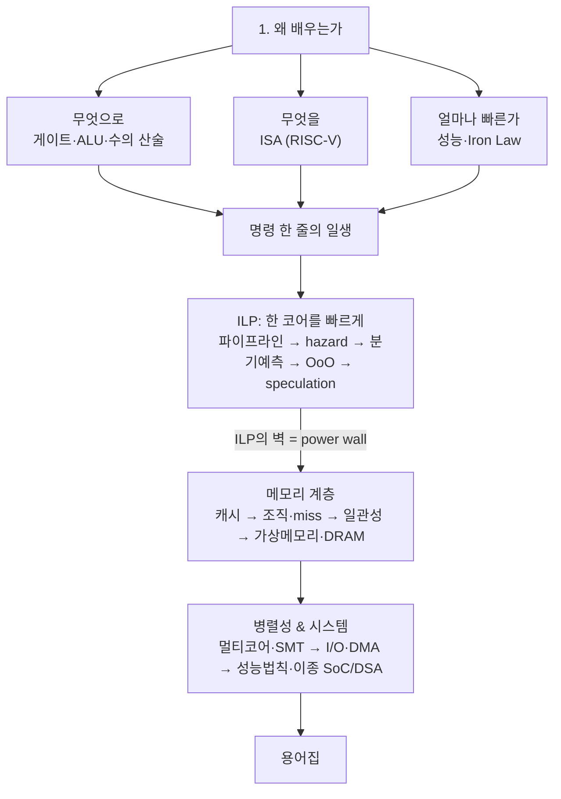

# 컴퓨터 구조 (Computer Architecture)

!!! abstract "학습 개요"
    - 📊 **레벨:** Intermediate ~ Advanced
    - 🎯 **학습 목표:** "한 줄의 명령이 어떻게 실행되고, 왜 빠른가/느린가"를 게이트부터 멀티코어·가속기까지 한 흐름으로 설명할 수 있다.
    - 🧭 **방식:** 코드 없이 개념·비유·다이어그램 중심. 단원당 5~15분 + 확인문제.

## 📐 개념 지도

---

## 📋 학습 플랜 (총 18단계)

### 동기

| # | 단원 | 핵심 질문 |
|---|---|---|
| 1 | [왜 컴퓨터 구조를 배우는가](unit1-why-comparch.md) ✅ | 소프트웨어 짜는데 왜 하드웨어를 알아야 하나? 추상화 아래에 뭐가 있나? |

### 기초 — 무엇으로 계산하나

| # | 단원 | 핵심 질문 |
|---|---|---|
| 2 | [게이트 → ALU](unit2-gates-alu.md) ✅ | 트랜지스터 몇 개가 어떻게 "덧셈"이 되나? |
| 3 | [수의 표현 & 산술 (2의 보수, 부동소수점, 오버플로)](unit3-number-representation.md) ✅ | 음수·소수를 0과 1로 어떻게 표현하고, 왜 0.1+0.2≠0.3인가? |
| 4 | [메모리와 레지스터](unit4-memory-registers.md) ✅ | 레지스터·메모리는 왜 나뉘고, 데이터는 어디에 사는가? |
| 5 | [명령 한 줄의 일생 (fetch→decode→execute→mem→writeback)](unit5-instruction-lifecycle.md) ✅ | `add x1,x2,x3` 한 줄이 실행되며 칩 안에서 무슨 일이 일어나나? |
| 6 | ['빠르다'를 재는 법 (latency vs throughput, CPI, Iron Law)](unit6-performance-measurement.md) ✅ | "빠른 CPU"란 정확히 뭘 말하나? 클럭? IPC? 무엇으로 재나? |

### 명령어 집합

| # | 단원 | 핵심 질문 |
|---|---|---|
| 7 | [ISA & RISC-V](unit7-isa-riscv.md) ✅ | 하드웨어와 소프트웨어의 계약(ISA)이란? 왜 RISC-V가 깔끔한가? |

### ILP — 한 코어를 빠르게

| # | 단원 | 핵심 질문 |
|---|---|---|
| 8 | 5-stage pipeline & hazard | 명령을 겹쳐 실행하면 왜 빨라지고, 무엇이 그걸 방해(hazard)하나? |
| 9 | 분기 예측 & speculation | "if문 결과를 모르는데" 어떻게 멈추지 않고 미리 달리나? |
| 10 | Tomasulo & ROB (동적 스케줄링·레지스터 리네이밍·OoO·superscalar) | 순서를 바꿔 실행하면서도 결과는 어떻게 순서대로 맞추나? ILP는 왜 한계에 부딪히나? |

### 메모리 계층

| # | 단원 | 핵심 질문 |
|---|---|---|
| 11 | 캐시 존재의 이유 (지역성, memory wall) | 메모리는 느린데 왜 CPU는 안 느린가? 지역성이란? |
| 12 | 캐시 조직 & miss (set-associative, 3C miss) | 캐시는 어떻게 조직되고, miss는 왜 나며 어떻게 줄이나? |
| 13 | 멀티코어 캐시 일관성 & 메모리 일관성 (MESI, consistency model) | 여러 코어가 같은 데이터를 각자 캐싱하면 누가 진짜인가? (TLB shootdown의 데이터 버전) |
| 14 | 가상 메모리 & DRAM *(← MMU 세션 내용 흡수)* | 프로세스마다 독립된 메모리 환상을 어떻게 만들고, DRAM은 어떻게 동작하나? |

### 병렬성 & 시스템

| # | 단원 | 핵심 질문 |
|---|---|---|
| 15 | 멀티코어 & 병렬성 (ILP→TLP, SMT, power wall) | 왜 클럭을 안 올리고 코어를 늘렸나? SMT란? |
| 16 | I/O · DMA · 인터럽트 (PCIe, 장치↔메모리, IOMMU 연결) | CPU는 장치와 어떻게 대화하고, 데이터는 어떻게 메모리로 들어오나? |
| 17 | 성능 법칙 & 이종 SoC/DSA (Amdahl·Dennard, 가속기) | 병렬화의 한계(Amdahl)는? 왜 GPU·NPU 같은 도메인특화 칩이 뜨나? |

### 정리

| # | 단원 | 핵심 질문 |
|---|---|---|
| 18 | 지금까지 나온 용어집 | 전 단원 핵심 용어를 한 장으로 — 빠른 복습용 레퍼런스. |

---

!!! note "진행 상태"
    단원 페이지는 순차적으로 채워 나갑니다. 🚧 준비 중 — 위 로드맵이 전체 그림입니다.
