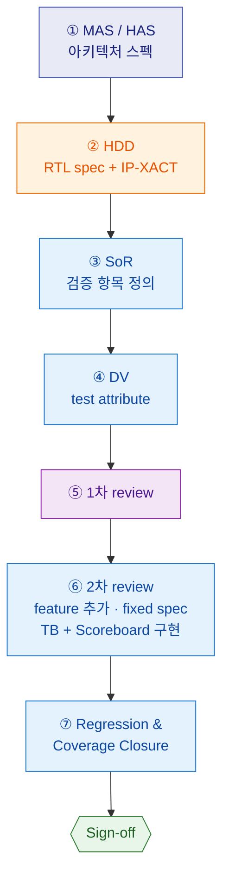

# DV Workflow

설계(Design)와 DV가 함께 진행하는 검증 전체 흐름을 정리한다.

## 한눈에 보기



> 🟦 DV 주관 · 🟧 설계 주관 · 🟪 공동 review · 🟩 종료

---

## 단계별 상세

### ① MAS / HAS — 아키텍처 스펙
- 아키텍처 사양을 정의하는 단계
- **설계팀과 DV팀이 함께 상의**하며 검토할 필요가 있음

### ② HDD — RTL spec + IP-XACT
- **HDD**: reg map, submodule, interface spec, function ...
- **IP-XACT**: bus connection, register group ...

### ③ SoR (Statement of Request)
- **검증 항목**을 정의

### ④ DV
- test attribute 정의

### ⑤ 1차 review

### ⑥ 2차 review
- feature 추가
- **fixed spec 기반**으로 진행
- coverage를 먼저 정하고, 그 **coverage를 타겟으로 TB 구현**

    구현 순서:

    ```text
    interface → data structure → env → top → ...
    ```

- **Scoreboard / Checker** — 정합성 판정의 핵심
    - 예상값(reference model)과 실제 DUT 출력을 비교
    - assertion·coverage가 못 잡는 *"출력 값이 맞는가"* 를 확인
    - 보통 env 안에 위치 (monitor가 뽑은 트랜잭션을 받아 비교)

### ⑦ Regression & Coverage Closure
- **Regression**: 전체 테스트를 정기적으로(예: nightly) 반복 실행해 회귀(regression) 발생 여부 확인
- **Coverage closure**: functional / code coverage가 목표치에 도달했는지 측정 → 미달 항목은 테스트 보강
- **Sign-off 기준**: 모든 테스트 pass + coverage 목표 달성 → 검증 종료

---

## 추가로 챙길 점

!!! warning "검증 시 중요"
    - **assertion timing 검증** 중요
    - **power 검증** 중요

!!! note "Mango 환경 참고"
    Mango는 FPGA 기반이라 power 검증 등 일부 항목은 보지 않고 있음.

---

## 용어 정리

| 약어 | 풀이 | 설명 |
| --- | --- | --- |
| **HAS** | Hardware Architecture Specification | 하드웨어 **아키텍처 사양서**. 시스템 전체의 구조·기능을 상위 수준에서 기술 |
| **MAS** | Micro Architecture Specification | **마이크로아키텍처 사양서**. 개별 블록 내부의 동작·구조를 상세히 기술 (HAS보다 하위/세부) |
| **HDD** | Hardware Design Document | RTL 설계 문서. reg map, submodule, interface spec 등 구현 수준의 내용 |
| **IP-XACT** | IEEE 1685 | IP/버스 연결, 레지스터 그룹 등을 기술하는 표준 XML 포맷 |
| **SoR** | Statement of Request | 검증해야 할 **요구/항목** 명세 |
| **DV** | Design Verification | 설계가 의도대로 동작하는지 검증하는 과정 |
| **TB** | Testbench | DUT를 둘러싼 검증 환경 |

> 참고: HAS/MAS 등 약어의 정확한 의미는 회사·팀마다 조금씩 다를 수 있다.
