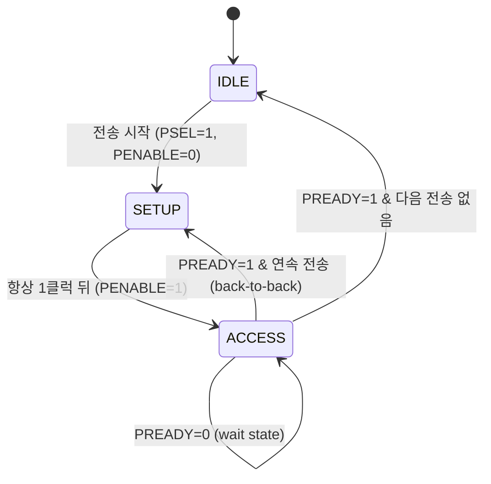

# Unit 1 — APB & AHB (AMBA의 두 클래식 버스)

> 핵심 질문: 칩 안의 블록들은 어떻게 서로 데이터를 주고받나? 왜 그 "약속(버스 프로토콜)"이 필요하고, 가장 단순한 APB와 파이프라인 버스 AHB는 read/write 한 번을 사이클 단위로 어떻게 처리하나?
>
> ※ 이 단원을 읽으며 나온 세부 질문(글리치, setup time, PSEL→PENABLE 2스텝, NONSEQ/SEQ, 2-cycle error, trade-off 등)은 별도 페이지 **`amba-unit1-qa.md`** 에 원문 그대로 정리돼 있다.

## 0. 핵심 한 문장

> **AMBA는 "칩 안의 블록들이 데이터를 주고받는 표준 약속(on-chip 버스 프로토콜)"이다.** 그리고 그 약속은 하나가 아니다 — 느린 주변장치엔 *단순한* APB, 빠른 메모리엔 *파이프라인* AHB처럼, **속도와 복잡도의 트레이드오프**에 따라 갈라진다. 이후 AMBA의 모든 진화(AXI, ACE…)는 이 둘에서 "더 빠르게, 더 동시에"로 뻗어나간 변주다.

---

## 1. 왜 버스 프로토콜이 필요한가

### 1-1. 문제 — 블록이 늘어나면 배선이 폭발한다

칩 안에는 CPU, 메모리, DMA, UART, GPIO, 타이머, 가속기… 수많은 블록이 산다. 이들을 **서로 직접 배선(point-to-point)** 으로 다 이으면?

```text
블록 N개를 전부 직접 연결 → 배선 수 ≈ N×(N-1)/2  (조합 폭발)

  CPU ─── MEM
   │ ╲   ╱ │
   │  ╲ ╱  │       4개만 돼도 벌써 6가닥.
  DMA ─── UART     10개면 45가닥. 100개면 4950가닥. → 칩이 배선으로 터짐
```

게다가 블록마다 "나는 이렇게 신호 주고받아"라는 방식이 제각각이면, 새 블록을 붙일 때마다 **번역기(glue logic)** 를 새로 짜야 한다. 재사용이 불가능하다.

### 1-2. 해법 — 공용 버스 + 표준 약속

그래서 **공용 통로(bus)** 를 깔고, 거기 붙는 모든 블록이 **같은 규칙**으로 말하게 한다.

```text
        ┌──────── 공용 버스 (shared interconnect) ────────┐
        │                                                  │
      CPU      MEM      DMA      UART      GPIO            │
        └──────────────────────────────────────────────────┘
   모두 같은 신호·타이밍 규칙(프로토콜)으로 붙음
```

이게 주는 것:

- **재사용성** — 규칙을 지키는 블록(IP)은 어느 칩에든 그대로 꽂힌다. (IP를 사서 붙이는 SoC 비즈니스의 토대)
- **확장성** — 새 블록은 버스 규칙만 지키면 끝. 다른 블록을 안 건드린다.
- **검증 가능성** — 규칙이 명문화돼 있으니 "이 규칙을 어겼나"를 기계적으로 체크(protocol checker)할 수 있다.

### 1-3. 그 "표준 약속"이 곧 버스 프로토콜

버스 프로토콜이 정하는 것:

- **어떤 신호**가 있고 (주소, 데이터, 제어…)
- **언제** 그 신호가 유효하며 (타이밍)
- **누가 누구를 기다리나** (핸드셰이크: "준비됐어?" / "받았어")
- **에러는 어떻게 알리나**

> **한 줄로:** 버스 프로토콜은 블록들 사이의 **언어이자 예절**이다. 무슨 단어(신호)를 언제(타이밍) 말하고, 상대가 들을 때까지 어떻게 기다리는지(핸드셰이크)를 못 박은 것.

---

## 2. AMBA란 무엇인가

> **AMBA (Advanced Microcontroller Bus Architecture) = ARM이 만든 on-chip 버스 프로토콜 표준 "모음".** 단일 프로토콜이 아니라, 용도별로 분화된 패밀리다.

### 2-1. 왜 "하나"가 아니라 "패밀리"인가

블록마다 요구가 극과 극이기 때문이다. GPIO는 1초에 한 번 깜빡이고, DMA는 매 사이클 데이터를 토한다. 이 둘에 같은 버스를 쓰면:

- 빠른 버스를 GPIO에 → 회로·전력 **과잉**.
- 느린 버스를 DMA에 → **병목**.

그래서 AMBA는 **계층(layered bus)** 으로 설계한다.

```text
        ┌──────── 고속 backbone (AXI / AHB) ────────┐
 CPU ──┤   메모리   DMA   고성능 가속기              │  ← 대역폭 중요
        └──────────────┬───────────────────────────┘
                       │  [Bridge] ← 속도·프로토콜 변환
                       ▼
        ┌──────── 저속 주변 (APB) ─────────────────┐
        │  UART   GPIO   Timer   I2C   CSR 블록     │  ← 단순·저전력 중요
        └──────────────────────────────────────────┘
```

> **backbone(백본)** = 칩 안에서 데이터가 가장 많이 흐르는 **중심 간선 버스**(대동맥). 도시의 고속도로처럼, 트래픽이 큰 핵심 경로(CPU↔메모리, DMA)에 빠른 프로토콜을 깔고, 저속 주변장치는 거기서 갈라져 나온 가지(APB)로 내린다.

### 2-2. 버전 히스토리

| 버전 | 연도 | 추가된 것 |
|---|---|---|
| AMBA 2 | 1999 | **AHB**, APB |
| AMBA 3 | 2003 | **AXI3**, AHB-Lite, APB3, ATB(trace) |
| AMBA 4 | 2010 | **AXI4**, AXI4-Lite, **AXI4-Stream**, **ACE/ACE-Lite**, APB4 |
| AMBA 5 | 2013~ | **CHI**, AXI5/ACE5, AHB5, Q/P-Channel(저전력) |

### 2-3. "어디에 뭘 쓰나" 결정표

| 용도 | 프로토콜 |
|---|---|
| 저속 레지스터/주변장치 (CSR, GPIO, timer) | **APB** |
| 중속 메모리/주변 (legacy backbone) | **AHB** |
| 고성능 메모리/마스터 (DMA, CPU↔메모리) | **AXI** |
| 단순 레지스터 slave (경량) | **AXI4-Lite** |
| 주소 없는 데이터 흐름 (DSP/비디오/패킷) | **AXI-Stream** |
| 캐시 일관성 (멀티코어, accel+CPU) | **ACE**(소규모) / **CHI**(대규모) |
| 클럭/파워 게이팅 핸드셰이크 | **Q-Channel / P-Channel** |

### 2-4. 마스터 / 슬레이브 — 기본 용어

- **Master(마스터):** 트랜잭션을 *시작*하는 쪽. 주소를 내고 "읽어/써"라고 명령. (CPU, DMA, 가속기)
- **Slave(슬레이브):** 그 명령에 *응답*하는 쪽. (메모리, 레지스터 블록, 주변장치)
- **Interconnect:** 마스터의 주소를 보고 알맞은 slave로 라우팅하는 중간 매트릭스 (decoder + mux).

> 이 단원의 APB/AHB는 모두 **master가 주도하고 slave가 따라가는** 단방향 명령 구조다. (AXI에서 응답 채널이 독립하며 이 구도가 바뀐다.)

---

## 3. APB — 가장 단순한 버스

> **APB (Advanced Peripheral Bus) = 저속·저전력 주변장치용. 파이프라인도, 버스트도, outstanding도 없다. 한 번에 딱 하나, 최소 2 사이클.**

### 3-1. 설계 철학 — "느려도 되니까 작게"

UART 레지스터 하나 쓰는 데 고속 버스가 필요할까? 아니다. APB는 의도적으로 고급 기능을 **버린다**:

- 트랜잭션이 **항상 하나씩** 순차 (overlap 없음).
- 버스트 없음 — 매 접근이 주소+데이터 한 쌍.
- 핸드셰이크가 단순해 **slave 구현이 거의 공짜** (FSM 몇 줄).
- 그 대가로 **느림**: 전송당 최소 2 사이클.

→ CSR(Control/Status Register) 블록, GPIO, 타이머, 저속 시리얼 IP에 딱.

> **APB의 대표 고객 (자세히는 Q&A Q2)**
> - **CSR 블록 (Control/Status Register):** SW가 HW를 제어/조회하는 레지스터 묶음. Control 레지스터로 명령("켜라/시작"), Status 레지스터로 상태 조회("busy/done/error").
> - **GPIO (General-Purpose Input/Output):** 칩의 범용 핀을 SW로 직접 0/1 읽고 쓰는 블록. 출력(LED), 입력(버튼). DIR/OUT/IN 레지스터 접근.
> - 둘 다 대역폭이 거의 필요 없어 APB에 붙인다.

### 3-2. 신호

| 신호 | 방향 | 설명 |
|---|---|---|
| `PCLK`, `PRESETn` | — | 클럭 / active-low 리셋 |
| `PSEL` | M→S | 이 slave 선택 (디코더가 주소 보고 올림) |
| `PENABLE` | M→S | **ACCESS phase** 표시 (둘째 박자) |
| `PADDR` | M→S | 주소 |
| `PWRITE` | M→S | 1=write, 0=read |
| `PWDATA` | M→S | write 데이터 |
| `PRDATA` | S→M | read 데이터 |
| `PREADY` | S→M | slave 준비 완료 → wait state 생성 (APB3+) |
| `PSLVERR` | S→M | 에러 응답 (APB3+) |
| `PSTRB` | M→S | byte strobe, write 전용 (APB4) |
| `PPROT` | M→S | 보호 속성: priv/secure/inst (APB4) |

### 3-3. 2-phase 구조

APB 전송은 **딱 두 박자**다. 이 FSM이 APB 이해의 90%.

```text
IDLE  →  SETUP  →  ACCESS  →  (IDLE 또는 다음 SETUP)

SETUP  (항상 1클럭): PSEL=1, PENABLE=0  — 주소/제어를 깔아둠
ACCESS (1클럭 이상): PSEL=1, PENABLE=1 — PREADY=1 되는 클럭에 전송 완료
```



> **왜 2박자인가?** SETUP에서 주소를 먼저 안정시키고, 한 박자 늦게 `PENABLE`을 올려 전송 시점을 명확히 하는 것. 단순함을 위해 속도를 양보한 설계다. (자세한 이유 → Q&A Q6)

### 3-4. APB write 한 번, 사이클 단위 추적

`PADDR=0x40`, `PWDATA=0xAB`를 쓰는 single write를 클럭별로 따라가 보자. (wait state 1개 포함)

```text
        T0        T1        T2        T3        T4
        IDLE      SETUP     ACCESS    ACCESS    IDLE
                            (wait)    (전송)

PCLK    ‾|_‾|_    ‾|_‾|_    ‾|_‾|_    ‾|_‾|_    ‾|_

PSEL     0    ___/‾‾‾‾‾‾‾‾‾‾‾‾‾‾‾‾‾‾‾‾‾‾‾\___
PENABLE  0    0      ___/‾‾‾‾‾‾‾‾‾‾‾‾‾‾\___
PWRITE   -    < 1 (write) ................... >
PADDR    -    <    0x40    ................... >
PWDATA   -    <    0xAB    ................... >
PREADY   -    -      0          1          -
                            ↑slave 아직   ↑slave 준비됨
                             안됨(wait)    → 이 클럭에 write 확정
```

| 클럭 | 상태 | 무슨 일이 일어나나 |
|---|---|---|
| **T0** | IDLE | 버스 놀고 있음. `PSEL=0`. |
| **T1** | SETUP | 마스터가 `PSEL=1` 올리고 `PADDR=0x40`, `PWRITE=1`, `PWDATA=0xAB`를 깔아둠. `PENABLE`은 아직 0. **항상 1클럭만 머문다.** |
| **T2** | ACCESS (wait) | `PENABLE=1`로 올림. slave가 아직 못 받아서 `PREADY=0` → **wait state**. 주소·데이터는 그대로 유지(움직이면 안 됨). |
| **T3** | ACCESS | slave가 `PREADY=1`. **이 클럭의 상승 에지에서 write가 실제로 일어난다.** slave 레지스터에 0xAB 기록. |
| **T4** | IDLE | `PSEL=PENABLE=0`. (다음 전송이 있으면 IDLE 대신 바로 SETUP으로.) |

> **핵심:** wait state가 없으면(slave가 즉시 `PREADY=1`) 정확히 **2클럭**(SETUP 1 + ACCESS 1). slave가 느릴 때만 ACCESS가 늘어난다. **SETUP은 절대 안 늘어나고, ACCESS만 늘어난다.** read도 동일한 타이밍이며, ACCESS에서 마스터가 `PRDATA`를 샘플링한다(→ Q&A Q10).

### 3-5. 한 번의 핸드셰이크 (자세히는 Q&A Q3)

핵심 신호 3개:

| 신호 | 누가 | 의미 |
|---|---|---|
| `PSEL` | 마스터→slave | "**너** 지목한다" |
| `PENABLE` | 마스터→slave | "이제 **진짜 전송**이다" |
| `PREADY` | slave→마스터 | "**받았어/준비됐어**" |

> 마스터가 **`PSEL`(지목) → `PENABLE`(전송 개시)** 로 두 박자에 걸쳐 요청을 내밀고, slave가 **`PREADY`(완료)** 로 답한다. **세 신호가 동시에 1이 되는 클럭**의 상승 에지에서 데이터가 오간다 — 그게 APB의 한 번의 핸드셰이크.

---

## 4. AHB — 파이프라인 버스

> **AHB (Advanced High-performance Bus) = 주소 phase와 데이터 phase를 한 클럭 어긋나게 겹쳐 흘리는 파이프라인 버스. 버스트 지원, 멀티마스터(arbiter) 가능.**

### 4-1. 핵심 아이디어 — 주소와 데이터를 겹친다

APB는 "주소 깔고 → 데이터 주고"를 직렬로 했다. AHB는 이 둘을 **한 클럭 어긋나게 겹친다.** 명령어 파이프라인과 똑같은 발상.

```text
        T1      T2      T3      T4
주소 :  [A1]    [A2]    [A3]
데이터:         [D1]    [D2]    [D3]
                ↑ A2의 주소 phase와 D1의 데이터 phase가 동시 진행
```

A1의 데이터를 주고받는 동안 이미 A2 주소를 깔고 있다 → 파이프가 차면 매 클럭 한 전송. **이게 AHB가 APB보다 빠른 이유 전부.**

### 4-2. AHB-Lite — 요즘의 기본형

원래 AHB는 멀티마스터를 위해 arbiter + **SPLIT/RETRY** 응답이라는 복잡한 장치를 가졌다. 실무에선 대부분 **AHB-Lite**(단일 마스터)를 쓴다 — arbitration·SPLIT·RETRY를 들어내 훨씬 단순하다. (멀티마스터가 필요하면 그 위에 interconnect를 둠.)

### 4-3. 신호

| 신호 | 방향 | 설명 |
|---|---|---|
| `HADDR` | M→S | 주소 (주소 phase) |
| `HTRANS[1:0]` | M→S | 전송 타입 (IDLE/BUSY/NONSEQ/SEQ) |
| `HWRITE` | M→S | 1=write |
| `HSIZE[2:0]` | M→S | 전송 크기 (2^HSIZE byte) |
| `HBURST[2:0]` | M→S | 버스트 타입 |
| `HPROT`, `HMASTLOCK` | M→S | 보호 속성 / locked 전송 |
| `HWDATA` | M→S | write 데이터 (데이터 phase) |
| `HRDATA` | S→M | read 데이터 (데이터 phase) |
| `HREADY` | S→M | 데이터 phase 완료 신호 (전 버스의 박자) |
| `HRESP` | S→M | 응답: OKAY(0) / ERROR(1) |
| `HSEL` | dec→S | slave 선택 (주소 디코더) |

> **`HREADY`가 버스의 심장박동이다.** `HREADY=1`인 클럭에 현재 데이터 phase가 끝나고 **동시에 다음 주소 phase도 확정**된다. 주소·데이터 phase가 같은 `HREADY`로 함께 전진하는 것이 AHB 파이프라인의 핵심.

### 4-4. HTRANS — 매 클럭 "이 주소가 무슨 의미인가"

파이프라인이라 매 클럭 주소가 흐른다. 그게 진짜 전송인지, 노는 건지, 버스트의 일부인지 알려야 한다.

| 값 | 이름 | 의미 |
|---|---|---|
| 00 | IDLE | 전송 없음 (버스 놀고 있음) |
| 01 | BUSY | 버스트 중 마스터가 잠깐 대기 (주소 유지, 전송 안 함) |
| 10 | NONSEQ | 버스트의 **첫** 전송 또는 단일 전송 |
| 11 | SEQ | 버스트의 **후속** 전송 (주소가 앞에 연속) |

(NONSEQ vs SEQ의 의미, 같은 주소를 전부 NONSEQ로 보내는 것 vs NONSEQ-SEQ로 보내는 것의 차이 → Q&A Q12, Q13)

### 4-5. AHB write 한 번, 사이클 단위 추적

**single write** (wait state 1개 포함). `HADDR=0x100`, `HWDATA=0xDE`.

```text
        T0      T1          T2          T3          T4
        ───── 주소 phase ──┤
                ─── 데이터 phase ──────┤

HCLK    ‾|_     ‾|_         ‾|_         ‾|_         ‾|_

HTRANS  IDLE  NONSEQ       IDLE
HADDR    -    <0x100>      < ... >
HWRITE   -    < 1 >
HWDATA   -      -        <    0xDE   (유지)    >
HREADY   1      1            0           1
                            ↑slave wait  ↑완료
```

| 클럭 | 무슨 일이 |
|---|---|
| **T0** | IDLE. `HTRANS=IDLE`. |
| **T1** | **주소 phase**: 마스터가 `HADDR=0x100`, `HWRITE=1`, `HTRANS=NONSEQ`를 냄. (데이터 `HWDATA`는 아직 안 냄!) |
| **T2** | **데이터 phase 시작**: 이제서야 `HWDATA=0xDE`를 냄. 주소 phase와 한 클럭 어긋난 것에 주목. 동시에 slave가 `HREADY=0` → **wait state**. |
| **T3** | slave가 `HREADY=1`. **이 클럭에 write 데이터가 실제로 받아들여진다.** `HWDATA`는 wait 동안 계속 유지돼야 함. |
| **T4** | 끝. |

> **APB와 결정적 차이:** APB는 주소와 데이터를 *같은 phase*에 함께 깔았다. AHB는 **주소를 먼저(T1), 데이터를 한 박자 뒤(T2)** 낸다. 이 "한 박자 어긋남" 덕에, 한 전송의 데이터 phase 동안 **다음 전송의 주소 phase를 겹칠 수 있다** — 그게 파이프라인.

### 4-6. 파이프라인이 빛나는 순간 — 연속 write

single 하나로는 파이프라인 효과가 안 보인다. **세 번 연속** 쓰면 겹침이 드러난다. (wait state 없다고 가정)

```text
        T1      T2      T3      T4      T5
HTRANS  NONSEQ  SEQ     SEQ     IDLE
HADDR   <A1>    <A2>    <A3>
HWDATA          <D1>    <D2>    <D3>
HREADY  1       1       1       1

해석:
  T2: A2 주소를 내는 "동시에" D1 데이터를 줌   ← 겹침!
  T3: A3 주소를 내는 "동시에" D2 데이터를 줌   ← 겹침!
  T4: 마지막 D3만 흘림

→ 3번 전송에 4클럭. APB식 직렬이면 6클럭(2×3).
  파이프가 차면 매 클럭 1전송에 수렴.
```

### 4-7. wait state와 파이프라인의 상호 잠금

`HREADY=0`으로 데이터 phase를 늘리면, 파이프라인이라 **그 뒤 주소 phase도 같이 밀린다.** 데이터 phase가 끝나야(`HREADY=1`) 다음 주소가 확정되기 때문. 즉 느린 slave 하나가 버스 전체의 박자를 잡는다.

### 4-8. 2-cycle ERROR — AHB의 까다로운 코너

에러는 한 클럭에 못 끝내고 **반드시 2클럭**으로 보낸다.

```text
        T1      T2      T3
HRESP   OKAY    ERROR   ERROR
HREADY  1       0       1
                ↑1번째   ↑2번째: 에러 확정·전송 종료
```

> **왜 2클럭?** 파이프라인이라 slave가 에러를 알아챈 시점엔 이미 **다음 전송의 주소 phase가 진행 중**이다. 마스터에게 "방금 거 실패, 다음 거 취소 준비해"라고 알릴 **한 박자의 여유**가 필요하다. 그래서 1클럭(ERROR+`HREADY=0`)으로 예고하고, 다음 클럭(ERROR+`HREADY=1`)에 확정한다. (왜 첫 박자에 에러를 띄워야 하고, "취소"가 뭘 뜻하는지 → Q&A Q14·Q15·Q16)

---

## 5. WRAP 버스트와 주소 계산

AHB(와 AXI)의 `HBURST`에는 INCR 계열과 WRAP 계열이 있다. WRAP의 주소 계산이 헷갈리니 따로 판다.

### 5-1. 버스트 종류

| 타입 | 동작 | 용도 |
|---|---|---|
| `SINGLE` | 1전송 | 일반 |
| `INCR` | 길이 미정, 주소 계속 증가 | 길이 모를 때 |
| `INCR4/8/16` | 고정 길이, 주소 증가 | 정해진 블록 |
| `WRAP4/8/16` | 경계에서 **되돌아 감(wrap)** | **캐시 라인 fill** |

### 5-2. 왜 WRAP이 필요한가 — critical word first

CPU가 캐시 miss로 한 라인(예: 32바이트)을 통째로 채워야 하는데, **정작 당장 필요한 word는 라인 중간**에 있을 수 있다. INCR로 라인 처음부터 채우면 필요한 word를 늦게 받는다. WRAP은 **필요한 word부터 먼저 받고, 라인 경계에 닿으면 라인 앞으로 돌아와** 나머지를 채운다 (critical word first).

비유하면 **운동장 트랙 돌기**: 정해진 구역(블록) 안에서만 주소가 돌고, 끝에 닿으면 출발선으로 되돌아온다.

### 5-3. 주소 계산 규칙

```text
한 전송 크기      = 2^HSIZE  (byte)            ← beat 하나가 옮기는 byte
버스트 beat 수    = 4 / 8 / 16  (WRAP4/8/16)
wrap 경계(byte)   = (한 전송 크기) × (beat 수)  ← 이 블록 안에서만 주소가 돈다

블록 시작 = floor(시작주소 / wrap경계) × wrap경계   (시작주소를 wrap경계로 내림 정렬)
다음 주소 = (현재 주소 + 전송크기) 가 wrap 경계를 넘으면 → 블록 시작으로 되돌아감
```

### 5-4. 예제 A — 블록 *중간*에서 출발 → 진짜로 wrap 일어남

```text
조건: WRAP4, HSIZE=2(4byte), 시작 0x34

wrap 경계 = 4byte × 4beat = 16byte(0x10)
블록 시작 = floor(0x34 / 0x10) × 0x10 = 0x30
블록 범위 = 0x30 ~ 0x3F

       0x30  0x34  0x38  0x3C │ 0x40...
        │     ●─────●─────●    │
        │     출발  2번  3번    경계!
        └──────────────────┘
              ↑ 4번째에서 0x40이 되려는데 블록 밖! → 0x30으로 되돌아옴

순서:  0x34 → 0x38 → 0x3C → 0x30      ← wrap 발생!

(같은 조건 INCR4라면:  0x34 → 0x38 → 0x3C → 0x40   블록 밖으로 그냥 증가)
```

### 5-5. 예제 B — 블록 *시작*에서 출발 → wrap이 안 일어남

```text
조건: WRAP8, HSIZE=2(4byte), 시작 0x1000

wrap 경계 = 4byte × 8beat = 32byte(0x20)
블록 범위 = 0x1000 ~ 0x101F   (0x1000은 이미 0x20 정렬됨)

0x1000 0x1004 ... 0x101C │ 0x1020
  ●──────●──────────●     │
  출발               8번째  여기서 버스트 끝
  └───────────────────┘
  8칸이 블록을 정확히 채움 → 되돌아올 일 없음

순서:  0x1000 → 0x1004 → ... → 0x101C      ← wrap 안 일어남 (INCR과 동일하게 보임)
```

> **5-5의 포인트:** 출발 주소가 블록 경계에 딱 맞으면(aligned) WRAP을 써도 INCR과 결과가 같아 보인다. **WRAP의 "되돌아옴"은 출발 주소가 블록 한가운데일 때만(예제 A) 나타난다.** (자세히는 Q&A Q17)

| | 출발 위치 | wrap? | 순서 |
|---|---|---|---|
| 예제 A | 블록 **중간**(0x34) | **예** | 0x34→0x38→0x3C→**0x30** |
| 예제 B | 블록 **시작**(0x1000) | **아니오** | 0x1000→…→0x101C |

---

## 6. APB vs AHB, 그리고 Bridge

### 6-1. 2-phase(APB) vs pipelined(AHB)

| 특성 | APB (2-phase) | AHB (pipelined) |
|---|---|---|
| 구조 | 주소+데이터 한 묶음, 순차 | 주소 phase / 데이터 phase 분리·겹침 |
| 데이터 타이밍 | 주소와 **같은** phase | 주소보다 **한 클럭 뒤** |
| 전송당 사이클 | 최소 2 | 파이프 차면 1/transfer |
| N번 전송 비용 | 2N 클럭 | **N+1 클럭** |
| 버스트 | ✗ | ✓ (INCR/WRAP) |
| 멀티마스터 | ✗ | ✓ (AHB), AHB-Lite는 단일 |
| wait 신호 | `PREADY` (ACCESS 연장) | `HREADY` (데이터 phase 연장 + 뒤 주소도 정체) |
| 에러 | `PSLVERR`, 1클럭 | `HRESP`, **2클럭** |
| 회로 복잡도 | 극소 | 중간 |
| 용도 | CSR, GPIO, 저속 IP | 메모리, 중속 backbone |

> 둘의 공통 한계: **single outstanding** — 응답(또는 데이터 phase 종료) 전에 다음 트랜잭션을 못 띄운다. ID도 없고 전부 in-order다(→ Q&A Q14 말미). 이 벽을 깨려고 AXI가 채널을 독립시키고 ID 기반 다중 outstanding/out-of-order를 도입한다 (다음 단원).

### 6-2. Bridge — 빠른 버스와 느린 버스를 잇는다

CPU는 고속 AHB에 붙어 있는데 UART는 저속 APB에 있다. 둘을 잇는 게 **AHB-to-APB Bridge**다. Bridge는 AHB 쪽에선 **slave**로, APB 쪽에선 **master**로 행세한다.

```text
   CPU ─[AHB master]─►  ┌──────────────┐  ─[APB master]─► UART/GPIO/...
                        │    Bridge     │
   AHB ◄─[AHB slave]──  └──────────────┘  ◄─[APB slave]─
        (빠름/파이프라인)         (느림/2-phase)
```

Bridge가 하는 일:

1. **프로토콜 변환**: AHB의 주소/데이터 phase·`HTRANS`를 APB의 SETUP/ACCESS·`PSEL`/`PENABLE`로 번역.
2. **속도 정합**: 빠른 AHB 트랜잭션을 받아 느린 APB 박자로 풀어줌. 그동안 AHB 쪽엔 `HREADY=0`(wait)으로 "기다려"라고 말함.
3. **응답 매핑**: APB의 `PSLVERR` ↔ AHB의 `HRESP=ERROR` 변환.

> Bridge는 두 프로토콜의 박자 차이를 **wait state로 흡수**한다. 검증의 핵심은 "느린 APB가 처리하는 동안 AHB 쪽을 제대로 잡아두나(`HREADY` 제어)", "에러/데이터가 변환 중 유실·중복되지 않나"다.

---

## 7. 왜 셋을 다 쓰나 — trade-off 관점

"AXI가 제일 강력한데 왜 APB·AHB를 아직도 쓰나?"는 결국 **"강력함은 공짜가 아니다"** 라는 trade-off 얘기다. (자세히는 Q&A Q18)

> **핵심:** 버스는 "성능"을 얻는 대신 "면적·전력·복잡도·검증비용"을 낸다. GPIO 하나에 AXI를 붙이는 건 편지 한 장 부치려고 화물 트레일러를 모는 격. **트래픽에 맞는 최소한의 버스**를 쓰는 게 정답이라서 셋이 공존한다.

### 7-1. 성능 기능에는 대가가 붙는다

| 성능 기능 | 얻는 것 | 내는 비용 |
|---|---|---|
| 채널 분리 (AXI 5채널) | 동시성, throughput | **배선 수 폭발**, 면적 |
| Outstanding/ID | 응답 안 기다리고 연속 발행 | 추적 버퍼, 상태 로직 |
| Out-of-order | 빠른 응답 먼저 받기 | reorder 로직, ID 매칭 |
| 버스트/파이프라인 (AHB) | 연속 접근 빠름 | FSM 복잡, `HREADY`/2-cycle error |
| 단순 2-phase (APB) | 회로 극소, 검증 쉬움 | 느림 |

### 7-2. 4가지 비용 축

- **① 면적/배선:** APB는 신호 십수 개로 거의 공짜. AXI는 5채널 × (주소·데이터·응답) → 신호 수백 개 + outstanding 버퍼 + ID 매칭 + reorder. GPIO처럼 수백 개 붙는 블록에 AXI를 쓰면 칩이 배선으로 터진다.
- **② 전력:** 게이트가 적게 토글 = 동적 전력 적음. APB는 idle 전력도 최소 + 클럭 게이팅 단순. AXI는 항상 도는 채널·버퍼가 많다.
- **③ 검증 비용:** APB는 체크할 규칙 한 줌. AXI는 ordering/outstanding/interleaving/ID/4KB 경계/exclusive… 수백 개. 단순 레지스터 블록에 AXI를 붙이면 그 검증을 통째로 떠안는다.
- **④ 지연/예측가능성:** APB 단일 접근은 "항상 2클럭"으로 단순·예측가능. AXI는 단일 접근에 여러 채널 핸드셰이크가 끼어 오히려 latency가 길 수 있다. AXI의 강점은 "많은 양을 동시에"이지 "하나를 빨리"가 아니다.

### 7-3. 의사결정 흐름

```text
이 블록이 1초에 얼마나 많은 데이터를 옮기나?
   │
   ├─ 거의 안 옮김 (레지스터 깔짝) ──────────► APB
   │
   ├─ 적당히 (연속 접근 좀, 마스터 단순) ─────► AHB
   │
   └─ 많이 (높은 대역폭, 동시 다발) ──────────► AXI
```

### 7-4. 계층화 — 셋을 한 칩에 섞는다

```text
        ┌──── AXI (고속 backbone/NoC) ────┐  ← 비싸지만 필수인 곳에만
 CPU ──┤   메모리   DMA   가속기            │
        └──────────────┬──────────────────┘
                       │ [AXI→AHB bridge]
                       ▼
        ┌──── AHB (중속) ────┐
        │   SRAM   ROM        │
        └─────────┬───────────┘
                  │ [AHB→APB bridge]
                  ▼
        ┌──── APB (저속, 수십 개) ────┐  ← 싸게 대량으로
        │  UART GPIO Timer I2C ...    │
        └─────────────────────────────┘
```

→ "고속도로 + 국도 + 골목길"을 섞듯, 트래픽 등급에 맞는 버스를 계층으로 깔아 면적·전력·검증비용을 최소화하면서 필요한 성능을 낸다.

---

## 핵심 정리

- **버스 프로토콜이 필요한 이유:** point-to-point는 배선이 N² 폭발 + 재사용 불가. 공용 버스 + 표준 약속이 재사용성·확장성·검증가능성을 준다.
- **AMBA = ARM의 on-chip 버스 표준 "패밀리".** 블록마다 요구가 달라 단일 프로토콜이 아니라 계층화(APB↔AHB↔AXI…).
- **APB = 2-phase(SETUP→ACCESS).** 주소·데이터를 한 묶음으로, 매 전송 최소 2클럭. SETUP은 항상 1클럭, wait state는 ACCESS만 늘린다.
- **AHB = 파이프라인.** 주소를 먼저, 데이터를 한 박자 뒤 — 그래서 한 전송의 데이터 phase에 다음 전송의 주소 phase를 겹친다. `HREADY`가 두 phase를 함께 전진시키는 박자. ERROR는 2클럭(예고+확정).
- **WRAP 버스트:** 버스트 크기로 정렬된 블록 안에서 주소가 원형으로 돈다. critical-word-first 캐시 fill용. 출발이 블록 중간일 때만 wrap이 보인다.
- **Bridge:** 빠른 AHB ↔ 느린 APB를 프로토콜 변환 + wait state로 속도 정합.
- **trade-off:** 성능(채널 분리·outstanding·OoO)은 면적·전력·배선·검증비용으로 산다. **트래픽에 맞는 최소한의 버스**를 골라 계층으로 섞는 게 정답 → 셋이 공존.
- **Golden rule:** APB·AHB 모두 *single outstanding*, ID 없음, 전부 in-order. "응답 전 다음 요청"이 안 되는 이 벽이 AXI를 낳는다.

---

## 🔌 검증 관점

- **APB FSM 위반:** SETUP 없이 ACCESS 진입, ACCESS 중 주소/`PWDATA` 변동, `PENABLE`이 `PSEL` 없이 뜸, `PREADY` 무한 0(deadlock).
- **AHB 2-cycle ERROR:** 1클럭 에러, 에러 첫 클럭에 `HREADY=1`, 에러 후 후속 전송이 제대로 취소되는지.
- **파이프라인 phase 정렬:** 주소 phase와 데이터 phase가 한 클럭 어긋나 제대로 짝지어지나(주소 A_n ↔ 데이터 D_n). wait state 중 `HWDATA`/주소 유지.
- **WRAP 주소:** wrap 경계 계산 오류, 시작 주소 비정렬 시 wrap 지점, INCR/WRAP 혼동, 4KB(또는 디코딩) 경계 거동.
- **버스트 문맥:** `HTRANS`(IDLE/BUSY/NONSEQ/SEQ) 전이 정확성, 버스트 도중 BUSY 삽입, 버스트가 인터커넥트에서 끊기지 않는지.
- **Bridge:** 속도차에서 데이터 유실·중복, `PSLVERR`↔`HRESP` 매핑, APB 처리 중 AHB `HREADY` 제어, back-to-back 변환.
- **공통:** reset 직후 첫 전송, `PREADY`/`HREADY`가 X일 때 FSM 오염(X-propagation), single-outstanding 가정이 깨지는 자극.

---

→ 이 단원을 보며 나온 모든 세부 질문과 답은 **`amba-unit1-qa.md`** 참고.
