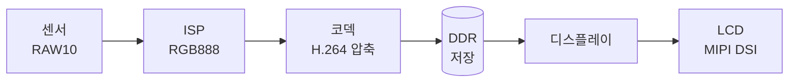

# SoC Top Integration

> **한 줄 요약**: IP 검증은 *부품이 맞는지*, SoC Top 검증은 *조립이 맞는지* 본다.
> 합쳤을 때만 생기는 버그는 따로 검증해야만 잡힌다.

---

## 1. 왜 필요한가 — 실화로 시작

어떤 칩에서 인터럽트 신호 하나가 **엉뚱한 GIC 포트에 연결**됐다.
이 버그는 **IP 단위 테스트는 전부 통과**했다. IP는 "신호 잘 보냈는데?" 하며 자기 일을 제대로 했기 때문이다. **연결이 틀린 건 IP가 알 수 없다.**

!!! danger "비용 임팩트"
    연결 버그 1개를 **칩 제작 후(post-silicon)** 발견 → **$1~3M mask 비용 + 6주 지연**.
    단 한 줄 실수로. → 그래서 "합친 다음의 검증"이 IP 검증만큼 중요하다.

---

## 2. 직관 — 건물 검사 vs 도시 준공검사

| 구분 | 비유 | 실제 의미 |
|---|---|---|
| **IP-level DV** | 건물 하나씩 검사 (전기·수도·구조) | IP 내부 기능 정확성 |
| **SoC Top-level DV** | **도시 전체** 준공검사 (도로 연결·주소·119 출동 경로) | IP끼리 **연결/상호작용** 정확성 |

두 단계 모두 필수인 이유:

1. **속도** — IP는 분 단위, SoC 전체 RTL은 시간 단위. 반복 검증은 IP에서.
2. **연결 정보의 위치** — `IP_A.irq_out → GIC.spi[N]` 매핑은 **`soc_top.sv`에만** 존재. IP TB엔 없다.
3. **상호작용 결함** — 리셋 순서, 전원 격리, 멀티마스터 버스 경합은 **합쳐야만** 나타난다.

!!! tip "기억할 한 가지"
    5가지 통합 버그가 모두 한 원인에서 나온다 →
    **"연결 메타데이터가 IP 테스트벤치엔 없다."**

---

## 3. 카메라 프레임 경로 예제

사진 한 장이 칩을 통과하는 경로:



| 단계 | 주체 | 동작 | 숨은 Top 연결 |
|---|---|---|---|
| ① | 센서 | 촬영, `sensor_irq_out` 발생 | → GIC **SPI[12]** |
| ② | ISP | RAW10 → RGB 변환, `frame_done` | 센서와 **동일 PIXCLK** |
| ③ | 코덱 | AXI-MM master로 DDR 쓰기 | sysMMU 거쳐 MC slave 포트4 |
| ④ | GIC | SPI[12/13/14] → CPU0 라우팅 | SPI 번호가 스펙(CSV)과 일치 |
| ⑤ | 디스플레이 | DDR에서 프레임 읽기 | 코덱 write 경로와 coherent |
| ⑥ | 디스플레이 | MIPI DSI 출력 | DSI 클럭 도메인 + `PD_VIDEO` 정렬 |

!!! note "핵심 통찰"
    이 경로는 **연결의 사슬**이다. 선 하나만 끊겨도 프레임이 사라진다.
    그런데 **IP 각각은 다 통과**한다 — 자기 바깥 연결을 모르니까.
    → **사진 한 장 경로 하나로 5가지 버그 유형을 동시에** 검증할 수 있다 (회귀 ROI 극대화).

---

## 4. 합쳤을 때만 나오는 5가지 버그

### ① Connectivity (연결) 오류

`IP_A.irq_out`을 `GIC.spi[47]`에 꽂아야 하는데 `spi[48]`에 꽂음.
→ IP는 인터럽트를 **정상 생성**(통과)하지만, 연결이 틀림. 이 정보는 `soc_top.sv`에만 있다.

### ② Clock / Reset 오류

- 200MHz 필요한 IP에 100MHz 공급
- 리셋 해제(deassert) **순서**가 틀림

!!! info "올바른 리셋 해제 순서"
    1. PLL Lock 확인
    2. Bus Fabric 리셋 해제
    3. Memory Controller 리셋 해제 *(DRAM 초기화 시간 필요)*
    4. 나머지 IP 리셋 해제

    순서가 틀려 CPU가 **초기화 안 된 DRAM**에 접근하면 → **boot hang / SLVERR**.

### ③ Memory Map (주소) 오류

두 IP의 주소 범위가 겹침.

!!! warning "겹친다고 꼭 에러가 나는 게 아니다"
    first-match 디코더가 먼저 매칭된 IP에게 **OKAY**로 응답 → 에러 없이
    **조용히 데이터가 망가진다(silent corruption)**. 가장 위험한 유형.

### ④ Interrupt Routing 오류

인터럽트가 엉뚱한 CPU/GIC 입력으로 가거나, 우선순위·보안그룹(Secure/Non-Secure) 설정 오류. GIC↔IP 매핑은 통합 시점에 결정된다.

### ⑤ Power Domain 오류

전원 끈 IP의 출력은 **자동으로 0이 되지 않는다.**

!!! danger "Isolation cell이 핵심"
    **격리 셀(isolation cell)이 작동해야만** 출력이 0으로 고정된다.
    없으면 **X(unknown)가 버스로 전파**되어 켜진 도메인을 오염 → post-silicon에서야 발견되는 대표적 silent bug.
    상태 전이: `Active → Idle → Retention → Off` 전 구간 검증 필요 (DVFS 포함).

---

## 5. 검증 방법 — Formal + Simulation 하이브리드

| 방법 | 역할 | 비유 |
|---|---|---|
| **Formal (JasperGold)** | 모든 연결을 **수학적으로 전수 증명** (구조) | 설계도 전체를 자로 다 잼 |
| **Simulation** | 실제 데이터 흘려 타이밍·핸드셰이크 확인 (동작) | 실제로 물을 틀어봄 |
| **DFT Scan** | 손 닿기 힘든 노드 직접 관찰 | 내시경 |

!!! question "왜 Formal이 필수인가"
    200 IP × ~50 신호 = **약 1만 개 연결점**.
    시뮬레이션으로 전수 검증 = 시나리오 수천 개 × 시간 단위 → 사실상 불가능.
    Formal은 스펙(CSV)에서 SVA 자동 생성 → **몇 시간 만에 1만 개 전수 증명**.

!!! question "왜 Simulation도 필요한가"
    Formal은 *"선이 연결됐다"(구조)*만 증명한다.
    *"제 값이, 제 타이밍에 도착했나, CDC는 안정적인가, AXI 순서는 맞나"(동작)*는
    **시뮬레이션만** 검증 가능.

> **결론**: Formal(구조 완전성) + Simulation(동작 정확성) **하이브리드**가 정답.

---

## 6. 코드 예제

### 6.1 연결 검증 SVA (스펙에서 자동 생성)

```systemverilog
// "IP_A.irq_out → GIC.spi[47]" 명세에서 자동 생성
property p_irq_connectivity;
  @(posedge clk) disable iff (!rst_n)
  ip_a_irq_out == gic_spi[47];
endproperty

ast_irq_conn: assert property (p_irq_connectivity)
  else `uvm_error("CONN_CHK", $sformatf(
    "IRQ mismatch: ip_a=%0b, gic[47]=%0b",
    ip_a_irq_out, gic_spi[47]))
```

!!! tip "SVA 작성 원칙"
    - **Positive**(맞는 연결) + **Negative**(엉뚱한 데 안 꽂혔나) 둘 다 작성
    - 1만 개를 손으로 못 쓰므로 **스펙(CSV/IP-XACT)에서 자동 생성**

### 6.2 Memory Map 검증 시퀀스 (3단계)

1. **Positive** — 각 IP base 주소 R/W → `OKAY` 기대
2. **Negative** — 미매핑 주소(예: `0xFFFF_0000`) → `DECERR` 기대
3. **Boundary** — 영역 마지막 바이트 `OKAY`, 바로 다음 주소 `DECERR`

---

## 7. 실전 디버그 시나리오

!!! example "증상: ISR이 timeout 내 실행 안 됨"
    ```text
    1단계: IP_A가 인터럽트 생성?      → ✅ 생성함
    2단계: GIC SPI[47]이 수신?        → ❌ 로그 없음
    3단계: soc_top.sv 연결 추적
            .spi_47(ip_b_irq_out)   ← IP_B가 잘못 연결!
            .spi_48(ip_a_irq_out)   ← IP_A가 엉뚱한 인덱스
    4단계: 원인 = 통합 시 포트 수동 매핑 실수
    5단계: 수정 + SVA 추가
    6단계: 회귀테스트로 재발 방지
    ```

    **IP 검증이 왜 못 잡았나?** IP_A TB엔 GIC도 외부 라우팅도 없다.
    "IRQ 토글됨"까지만 확인 — 목표 SPI 번호는 IP 관심 밖.

---

## 8. 자주 하는 오해 (Misconceptions)

| 오해 | 진실 |
|---|---|
| "SoC Top 통과하면 IP DV 불필요" | Top은 통합 버그만. 기능 버그·코너케이스는 IP에서만 |
| "Formal 연결 검사면 충분" | Formal은 *구조*만 증명. 값·타이밍·CDC·AXI 순서는 시뮬 필요 |
| "리셋 한 번 = 안전 초기화" | 멀티도메인 리셋은 비동기 해제. 순서 틀리면 boot hang |
| "주소 겹치면 즉시 DECERR" | first-match로 OKAY 응답 가능 → silent corruption |
| "전원 끄면 출력 0" | isolation cell 있어야 0. 없으면 X 전파 |
