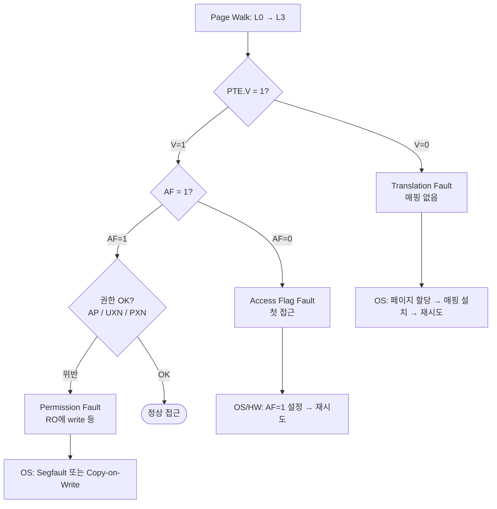

# 기본 개념 및 주소 변환

> **한 줄 요약**: MMU는 각 프로세스에 독립된 가상 주소 공간을 주고, page table로 VA(가상주소)→PA(물리주소)를 변환해 **프로세스 격리·메모리 보호**를 제공한다.

---

## 학습 목표

- 가상 주소가 해결하는 **5가지 문제** 설명 (주소 충돌·메모리 보호·단편화·물리 한계·보안 격리)
- MMU의 **3가지 핵심 기능** 구분: 주소 변환 · 권한 체크 · 캐시 속성 제어
- 완전한 **VA→PA 변환 사이클** 추적
- Exception Level별 **translation regime** 책임 식별
- 부트 코드에서 **MMU enable 시퀀스** 적용

---

## 1. 문제 정의 — 왜 격리가 필요한가

멀티 프로세스 시스템의 핵심 과제는 **process isolation**이다.

!!! danger "MMU가 없다면"
    두 프로세스가 물리 DRAM 주소를 직접 공유하면:

    - **보안 문제** — 한 프로세스가 다른 프로세스의 password를 읽음
    - **데이터 무결성 문제** — 동시 쓰기로 공유 상태가 corruption

MMU는 각 프로세스에 **독립된 가상 주소 공간**을 부여한다. 같은 VA(예: `0x4000_1234`)가 **실행 중인 프로세스에 따라 완전히 다른 PA**로 매핑된다. 이 매핑은 프로세스별 **page table**에 저장되고 OS 커널이 관리한다.

---

## 2. 가상 주소가 해결하는 5가지 문제

| # | 문제 | 해결 |
|---|---|---|
| 1 | **Address collision** | 다른 프로세스가 동일 VA를 충돌 없이 사용 |
| 2 | **Memory protection** | 페이지 단위 R/W/X 권한으로 무단 접근 차단 |
| 3 | **Fragmentation** | 가상은 연속, 물리는 흩어져 있어도 됨 |
| 4 | **Physical memory limits** | Swap/demand paging으로 가용 메모리 확장 |
| 5 | **Security isolation** | 프로세스 A가 B의 물리 주소를 알아낼 수 없음 |

---

## 3. MMU의 3가지 핵심 기능

| 기능 | PTE 필드 | 검증 포인트 |
|---|---|---|
| 주소 변환 (VA→PA) | `OutputAddress[47:12]` | walk 후 PA bit-exact 일치 |
| 접근 권한 체크 | `AP[7:6]`, `UXN`, `PXN`, `NS`, `AF` | fault class·level 정확성 |
| 캐시 속성 제어 | `AttrIdx[4:2]` → `MAIR_EL1` | 속성 전파 (Normal WB vs Device-nGnRnE) |

---

## 4. 주소 변환 메커니즘 — VPN vs Offset 분리

가상 주소는 **다르게 변환되는 두 부분**으로 나뉜다.

- **VPN (Virtual Page Number)** — multi-level page table walk로 변환
- **Page Offset** — 변환 없이 그대로 통과

```text
48-bit VA + 4KB 페이지
VA[47:12] = VPN (36-bit)  → page table lookup → PPN
VA[11:0]  = Offset (12-bit) → PPN에 그대로 concatenate
결과: PA = (PPN << 12) | offset
```

!!! note "불변식"
    4KB 페이지 안의 모든 주소는 **같은 변환을 공유**하되 각자 고유한 byte offset을 유지한다. → **Offset은 절대 변환되지 않는다.**

---

## 5. 단계별 변환 흐름 (Worked Example)

> 프로세스 A (`ASID=5`, `TTBR0_EL1=0x8000_0000`)가 VA `0x4000_1234`를 read하는 전체 흐름.

### 전체 플로우

```mermaid
flowchart TD
    START([VA 0x4000_1234 접근]) --> TLB{① TLB Lookup<br/>ASID=5, VPN}
    TLB -->|Hit ⚡| FAST[1-cycle 반환<br/>PA + 권한 + 속성]
    TLB -->|Miss| WALK[② Page Walk<br/>L0 → L1 → L2 → L3]
    WALK --> PERM{③ Permission Check<br/>AP / UXN / PXN / AF}
    PERM -->|위반| FAULT[Permission Fault<br/>→ OS 처리]
    PERM -->|OK| PA[④ PA Synthesis<br/>PPN << 12 | offset]
    PA --> FILL[⑤ TLB Fill<br/>결과 캐시]
    FILL --> MEM[⑥ Memory Access<br/>DRAM read @ PA]
    FAST --> MEM
```

### 단계별 설명

#### ① TLB Lookup — "북마크 먼저 확인"

`(ASID=5, VPN)`을 키로 TLB를 조회한다. 가장 먼저, 가장 빠른 경로.

- **Hit**: 변환 결과가 캐시에 있음 → **1 cycle(~0.5ns)** 만에 `PA + 권한 + 속성` 반환. 이후 단계 전부 건너뜀.
- **Miss**: 캐시에 없음 → ②번 Page Walk로 진행.

!!! tip
    ASID로 프로세스를 구분하므로, 다른 프로세스가 같은 VA를 써도 충돌하지 않는다.

#### ② Page Walk — "주소록을 단계별로 뒤짐" (TLB miss일 때만)

메모리에 있는 page table을 L0→L1→L2→L3 4단계로 순회한다. 각 단계에서 VA의 해당 비트로 인덱스를 만들어 다음 표의 주소를 얻는다.

```text
L0: TTBR0   + VA[47:39] × 8 → PTE (다음 레벨 지시)
L1: L1_base + VA[38:30] × 8 → PTE (다음 레벨 지시)
L2: L2_base + VA[29:21] × 8 → PTE (다음 레벨 지시)
L3: L3_base + VA[20:12] × 8 → PTE (page descriptor, AP=01, AF=1)
```

- 메모리를 최대 **4번** 읽으므로 **~400ns** 소요 (TLB hit보다 ~800× 느림).
- 중간 PTE가 `V=0`이면 → **Translation Fault** → OS가 demand paging 처리.

#### ③ Permission Check — "접근해도 되는지 검사"

찾은 PTE의 권한 비트로 현재 접근(load/store/execute)이 허용되는지 확인한다.

| 비트 | 검사 내용 |
|---|---|
| `AP[7:6]` | 읽기전용(RO) vs 읽기쓰기(RW), EL0/EL1 권한 레벨 |
| `UXN` / `PXN` | User/Privileged에서 실행 금지 여부 |
| `AF` | 한 번도 접근 안 됨(0)이면 fault (HW auto-set 없을 때) |

- **위반** → Permission Fault → OS 처리(Segfault 또는 Copy-on-Write).
- **OK** → ④번으로.

#### ④ PA Synthesis — "최종 물리주소 조립"

찾은 물리 페이지 번호(PPN)에 변환되지 않은 offset을 그대로 붙인다.

```text
PA = PTE.OutputAddr[47:12] << 12 | VA[11:0]
   = 0x9_2000              | 0x234
   = 0x9_2234
```

!!! note "불변식"
    `VA[11:0]` offset은 변환을 거치지 않고 PA 하위 비트에 그대로 들어간다. → 같은 페이지 안 주소들은 변환을 공유하되 byte 위치는 유지된다.

#### ⑤ TLB Fill — "다음을 위해 북마크 추가"

이번에 계산한 결과를 TLB에 저장한다. 저장하는 건 PA만이 아니다.

```text
캐시 내용: (ASID, VPN, PPN, 권한, 속성, page size)
```

→ 다음에 같은 VA를 접근하면 ①에서 바로 Hit → 1 cycle.

#### ⑥ Memory Access — "진짜 메모리 읽기"

최종 PA로 DRAM에 접근한다. 이때 PTE의 속성(예: Write-Back cacheable)에 따라 캐시 동작이 결정된다.

```text
DRAM read @ PA = 0x9_2234  (Write-Back cacheable)
```

### 핵심 요약

!!! abstract "한눈에"
    - **Offset은 변환되지 않는다** — VA[11:0]이 PA에 그대로.
    - **TLB hit이면 ②~⑤를 건너뛴다** — 1 cycle vs ~400ns (~800× 차이).
    - **TLB는 (PA, 권한, 속성)을 통째로 캐시** — 그래서 page table 변경 시 TLBI 필수.
    - **Fault는 두 종류** — Translation(②, 매핑 없음) / Permission(③, 권한 위반).

---

## 6. Translation Regimes (ARM Exception Levels)

```text
EL0/EL1 (Stage 1):  VA → PA/IPA   (OS가 TTBR0/TTBR1로 관리)
EL2     (Stage 2):  IPA → PA      (Hypervisor가 EL1의 IPA 변환)
EL3     (Secure):   별도 regime    (Firmware가 TTBR0_EL3 관리)
```

각 regime은 독립된 page table·TLB entry를 가져 서로 충돌하지 않는다.

---

## 7. MMU Enable 시퀀스 (Bootloader)

```text
1. identity mapping으로 page table 구성
   (전환 중 부트로더 코드의 VA == PA 여야 함)
2. TTBR0_EL1   ← page table base 주소
3. TCR_EL1     ← VA size, granule, caching policy
4. MAIR_EL1    ← 속성 정의 (Normal WB slot, Device-nGnRnE slot 등)
5. SCTLR_EL1.M ← 1   (MMU Enable)
6. ISB               (Instruction Synchronization Barrier)
```

!!! warning "ISB는 필수 (non-negotiable)"
    5단계 후 ISB가 없으면 파이프라인 잔류 명령이 **변환 안 된 채 실행**되어 즉시 fault 또는 잘못된 메모리 접근이 발생한다.

---

## 8. 페이지 크기 & Offset 관계

| 페이지 크기 | Offset 비트 | 용도 |
|---|---|---|
| 4 KB | 12 | 표준 OS (Linux, Windows) |
| 16 KB | 14 | ARM iOS |
| 64 KB | 16 | HPC, 서버 |
| 2 MB (Huge) | 21 | 큰 연속 할당 |
| 1 GB (Giga) | 30 | 서버/가속기 매핑 |

> 큰 페이지는 TLB miss를 줄이지만 **internal fragmentation**이 증가한다 (trade-off).

---

## 9. 메모리 속성 (Cacheability 제어)

PTE의 `AttrIdx[4:2]`가 `MAIR_EL1`의 8개 slot을 인덱싱한다.

- **Cacheable (Normal WB)** — 캐시 저장, write-back; DRAM용
- **Non-cacheable (NC)** — 캐시 우회; 휘발성 device 레지스터용
- **Write-through (WT)** — 캐시·메모리 동시 업데이트
- **Device-nGnRnE** — no caching / no gathering / no reordering / no early write ack; MMIO에 strict ordering 강제

> MMIO에 잘못된 속성을 주면 silent transaction reordering 또는 stale read 발생.

---

## 10. Page Fault 종류 & 처리

> Page Fault = VA→PA 변환 중 문제가 생겨 정상 접근이 불가능한 상황. 종류에 따라 OS의 대응이 다르다.

### 발생 위치



### 세 가지 Fault 종류

| 종류 | 원인 | OS 대응 |
|---|---|---|
| **Translation Fault** | `PTE.V = 0` (매핑 없음) | 페이지 할당, 매핑 설치, 재시도 |
| **Permission Fault** | AP mismatch (RO에 write 등) | Segmentation fault 또는 Copy-on-Write |
| **Access Flag Fault** | `AF = 0` (한 번도 접근 안 됨) | `AF = 1`로 업데이트 후 재시도 (SW-managed인 경우) |

### 단계별 설명

#### ① Translation Fault — "주소록에 항목이 없음"

Page walk 도중 PTE의 **Valid 비트가 0**이면, 해당 VA는 아직 물리 메모리에 매핑되지 않은 것이다.

- **언제**: 처음 접근하는 페이지, 또는 디스크로 swap-out된 페이지.
- **OS 대응**:
  ```text
  1. 물리 페이지 할당 (또는 디스크에서 swap-in)
  2. PTE에 매핑 설치 (V=1, PPN, 권한 설정)
  3. 폴트 난 명령 재시도(retry)
  ```
- 이것이 **demand paging**(필요할 때 페이지 할당)의 핵심 메커니즘.

#### ② Permission Fault — "권한이 없음"

매핑은 있지만(`V=1`), 시도한 접근이 PTE 권한과 맞지 않는다.

- **예시**: 읽기전용(RO) 페이지에 write 시도, 또는 실행 금지(UXN/PXN) 영역에서 코드 실행.
- **OS 대응**:
    - 진짜 위반이면 → **Segmentation Fault** (프로세스 종료).
    - **Copy-on-Write(CoW)** 상황이면 → 새 페이지 복사 후 RW로 바꿔주고 재시도.

!!! note "CoW 예시 (fork)"
    ```text
    fork() 후 부모·자식이 같은 물리 페이지를 RO로 공유
    → 자식이 write 시도 → Permission Fault
    → OS: 새 페이지 할당 + 내용 복사 + 자식 PTE를 RW로 변경
    → TLBI로 자식 TLB 무효화 → 명령 재시도
    ```

#### ③ Access Flag Fault — "한 번도 접근된 적 없음"

PTE의 **Access Flag(AF)가 0**이면, 그 페이지가 한 번도 접근되지 않았다는 의미다.

- **용도**: OS가 "어떤 페이지가 실제로 쓰이는지" 추적(페이지 교체 정책에 사용).
- **대응**:
    - HW가 `FEAT_HAFDBS`를 지원하면 → **하드웨어가 자동으로 AF=1** 설정.
    - 미지원이면 → **OS 핸들러가 명시적으로 AF=1** 설정 후 재시도.

!!! danger "실전 함정 — 무한 Fault 루프"
    PTE를 `AF=0`으로 초기화했는데 HW가 auto-set을 안 하고(`FEAT_HAFDBS` 없음), OS 핸들러도 AF 설정을 빠뜨리면 → **모든 접근이 계속 fault** → 무한 루프 또는 심각한 성능 저하.

### Fault Handler의 필수 마무리: TLBI + 배리어

어떤 fault든 핸들러가 PTE를 수정했다면, **반드시 TLB를 무효화**해야 한다. 안 그러면 낡은 TLB entry가 살아남아 재시도해도 옛날 값으로 또 fault 나거나 잘못된 PA를 쓴다.

```text
PTE 수정
   ↓
TLBI VAE1, Xt   ← 해당 VA의 낡은 TLB entry 무효화
   ↓
DSB ISH         ← 모든 코어에 반영 완료될 때까지 대기
   ↓
ISB             ← 파이프라인 정리
   ↓
ERET            ← 폴트 난 명령으로 복귀(재시도)
```

!!! warning "TLBI 누락 = 무한 루프"
    Page fault handler가 PTE만 업데이트하고 **TLBI를 건너뛰면**, 재시도 시 TLB의 낡은 entry(V=0 또는 옛 권한)를 다시 읽어 → **같은 fault가 무한 반복**된다.

### 핵심 요약

!!! abstract "한눈에"
    - Fault는 **검사 순서**대로 갈린다: `V=0`(Translation) → `AF=0`(Access Flag) → 권한 위반(Permission).
    - **Translation Fault** = demand paging의 정상 동작(에러 아님).
    - **Permission Fault** = 진짜 위반(Segfault) 또는 CoW 트리거.
    - 핸들러가 PTE를 고쳤으면 **TLBI → DSB ISH → ISB**가 필수 (누락 시 무한 루프).

---

## 11. Secure vs Non-Secure (TrustZone)

`PTE[5]` (NS bit)가 물리 주소 가시성을 제어한다.

- **NS = 0** — Secure 물리 메모리 접근 가능 (제한적)
- **NS = 1** — Non-Secure 메모리만 (Normal World)

Bus 레벨의 **TZASC**가 region 분할을 강제 → Normal World가 Secure 접근 시도 시 **Slave Error**.

---

## 12. CPU MMU vs IOMMU/SMMU

| 항목 | CPU MMU | SMMU |
|---|---|---|
| 위치 | CPU 내부 | Bus fabric / standalone IP |
| 사용자 | CPU 코어 | DMA 엔진, GPU, 가속기 |
| 목적 | 프로세스 격리 | 디바이스 격리 + DMA 보호 |
| TLB | per-core | 공유 IOTLB |
| 성능 | per-instruction (critical) | per-DMA-transaction |

---

## 13. 흔한 오해 (Common Misconceptions)

| ❌ Myth | ✅ Reality |
|---|---|
| "MMU enable = 자동 secure" | 보안은 정책 의존. 잘못된 PTE면 격리 즉시 무너짐. MMU는 *집행 도구*이지 *정책*이 아님 |
| "TLB는 PA만 저장" | TLB entry = (VA, ASID, **PA, 권한, 속성**). TLBI 없이 PTE 수정 시 stale 권한으로 silent 위반 |
| "TLBI는 즉시 전 코어 반영" | `DSB ISH` + `ISB` 있어야 모든 코어가 새 변환 관찰 |
| "MMU off(M=0) = 변환 없음" | 여전히 identity mapping을 device-like 캐시 속성으로 강제 |

---

## 14. DV 검증 체크리스트

| 증상 | Root Cause | 디버깅 포인트 |
|---|---|---|
| MMU enable 직후 Prefetch Abort | 부트로더 VA에 identity mapping 없음 | 현재 PC의 VA→PA entry를 TTBR0에서 확인 |
| Translation Fault level=0 | L0 walk fault; ESR.IFSC 부정확 | `ESR_EL1.IFSC[5:2]` 인코딩 검증 |
| 같은 VA: A는 OK, B는 fault | TTBR0 swap 했는데 ASID 미업데이트 | context-switch에서 TTBR0+ASID 동시 업데이트 |
| Write가 silent하게 무시됨 | `PTE.AP`=RO; stale RW 캐시 | PTE 변경 후 `TLBI VAE1 + DSB ISH + ISB` |
| Device 레지스터 write reorder | MAIR slot이 Normal Cacheable로 오설정 | `MAIR_EL1` vs Device-nGnRnE 확인 |
| Normal World가 Secure 접근됨 | `PTE.NS` 미설정 / TZASC 미설정 | `PTE[5]`·TZASC region 검증 |
| Page fault handler 무한 루프 | PTE 업데이트 후 TLBI skip | exception return 전 TLBI-by-VA 추가 |

---

## 15. 핵심 정리

1. **VA→PA 변환은 triple을 만든다: (PA, 권한, 속성)** — TLB가 셋 다 캐시하므로 stale 권한 비트는 silent correctness 이슈
2. **MMU는 HW와 SW 사이의 계약(contract)** — HW(lookup/walk/check) + SW(page table 구성, ASID 관리, fault 처리, TLBI)
3. **Enable 시퀀스는 brittle** — page table·TTBR·TCR·MAIR이 M=1 *전에* 정확해야 하고 ISB는 필수
4. **Offset은 절대 변환되지 않는다**
5. **Stale 변환은 silent하다** — 적절한 TLBI·배리어 없으면 변경이 예측 불가하게 전파

---

## 📖 용어 사전 (Glossary)

| 용어 | 풀이 |
|---|---|
| **MMU** | Memory Management Unit. VA→PA 변환·권한 체크·캐시 속성 제어를 수행하는 하드웨어 |
| **VA / PA** | Virtual Address(프로그램이 보는 가상 주소) / Physical Address(실제 메모리 주소) |
| **IPA** | Intermediate Physical Address. Stage 2 변환에서 게스트 OS가 보는 중간 주소 |
| **VPN / PPN** | Virtual / Physical Page Number. 페이지 단위의 가상·물리 번호 |
| **Page Offset** | 페이지 내부의 byte 위치. 변환되지 않고 그대로 통과 |
| **Page Table** | VA→PA 매핑을 담은 표. 프로세스마다 별도, OS 커널이 관리 |
| **PTE** | Page Table Entry. 변환 결과(출력 주소)와 권한·속성 비트를 담은 한 칸 |
| **Page Walk** | TLB miss 시 page table을 L0→L3 단계로 순회해 PA를 찾는 과정 |
| **TLB** | Translation Lookaside Buffer. 최근 변환 결과(VA, ASID, PA, 권한, 속성)를 캐시 |
| **IOTLB** | SMMU가 사용하는 공유 TLB (디바이스용) |
| **ASID** | Address Space ID. 프로세스를 구분하는 ID. TLB entry에 태깅돼 flush 없이 문맥 전환 가능 |
| **AF (Access Flag)** | 해당 페이지가 한 번이라도 접근됐는지 표시하는 비트. 0이면 fault(또는 HW auto-set) |
| **AP[7:6]** | Access Permission. 읽기전용(RO)/읽기쓰기(RW)와 권한 레벨을 정하는 비트 |
| **UXN / PXN** | User / Privileged Execute Never. 해당 권한에서 코드 실행 금지 비트 |
| **NS bit (PTE[5])** | Non-Secure 비트. Secure/Non-Secure 물리 메모리 가시성 제어 (TrustZone) |
| **AttrIdx[4:2]** | MAIR_EL1의 8개 속성 slot 중 하나를 가리키는 인덱스 |
| **MAIR_EL1** | Memory Attribute Indirection Register. 캐시 속성(slot 8개) 정의 레지스터 |
| **TTBR0 / TTBR1** | Translation Table Base Register. page table의 시작 주소를 담는 레지스터 |
| **TCR_EL1** | Translation Control Register. VA size·granule(페이지 크기)·캐싱 정책 설정 |
| **SCTLR_EL1.M** | System Control Register의 MMU enable 비트 (1이면 MMU 활성) |
| **Granule** | page table이 사용하는 기본 페이지 크기 (4KB/16KB/64KB) |
| **Internal Fragmentation** | 큰 페이지를 할당했을 때 실제로 안 쓰는 내부 공간이 낭비되는 현상 |
| **Identity Mapping** | VA == PA로 맞춘 매핑. MMU enable 전환 순간 부트로더 코드가 깨지지 않게 함 |
| **Translation Fault** | PTE.V=0 (매핑 없음)으로 발생하는 fault |
| **Permission Fault** | AP 권한 위반(예: RO에 write)으로 발생하는 fault |
| **Copy-on-Write (CoW)** | 공유 페이지에 write 시 그 순간 복사본을 만드는 기법 |
| **TLBI** | TLB Invalidate. 변경된 PTE에 해당하는 낡은 TLB entry를 무효화하는 명령 |
| **DSB ISH** | Data Synchronization Barrier (Inner Shareable). 메모리 동작 완료를 전 코어에 보장 |
| **ISB** | Instruction Synchronization Barrier. 파이프라인을 flush해 명령 동기화 강제 |
| **MMIO** | Memory-Mapped I/O. 디바이스 레지스터를 메모리 주소로 접근하는 방식 |
| **Device-nGnRnE** | no Gathering / no Reordering / no Early write ack. MMIO에 strict ordering 강제하는 속성 |
| **Normal WB / NC / WT** | Write-Back(캐시 후 지연 기록) / Non-Cacheable / Write-Through(동시 기록) 캐시 속성 |
| **TrustZone** | ARM의 Secure/Non-Secure 분리 보안 아키텍처 |
| **TZASC** | TrustZone Address Space Controller. bus 레벨에서 Secure region 분할 강제 |
| **ESR_EL1.IFSC** | Exception Syndrome Register의 Instruction Fault Status Code. fault 종류·레벨 인코딩 |
| **Exception Level (EL0~EL3)** | ARM의 권한 레벨. EL0(앱) < EL1(OS) < EL2(Hypervisor) < EL3(Firmware) |
| **Stage 1 / Stage 2** | Stage 1: VA→PA/IPA(OS) / Stage 2: IPA→PA(Hypervisor) 2단계 변환 |
| **SMMU / IOMMU** | System/IO MMU. DMA·GPU 등 디바이스용 주소 변환·격리 유닛 |
